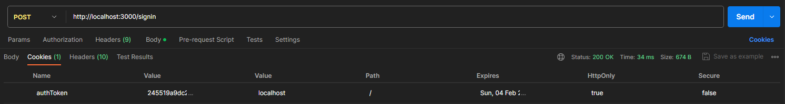
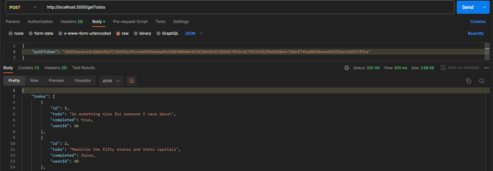

# Protect Website from XSS and CSRF

This project is a demonstration of how to protect website from [XSS](https://en.wikipedia.org/wiki/Cross-site_scripting) and [CSRF](https://en.wikipedia.org/wiki/Cross-site_request_forgery) attacks.

## Purpose

After learning the nature of XSS and CSRF, I feel it is important to know how to protect our website. So I built this todo list demo, not trying to show todo list functionalities, but to demostrate how to defend it from XSS and CSRF attacks.

## Implementation

### Protect from XSS
XSS uses the loophole of the injected malicious javascript script is able to access cookie through
```js
document.cookie
```
Attacker injects malicious script into webpage which sends request to malicious server with victim's cookies. 
With these cookies, attacker is able to access target website on victim's behalf.

To prevent XSS attack, set the cookie attribute [httpOnly](https://developer.mozilla.org/en-US/docs/Web/HTTP/Cookies#restrict_access_to_cookies) to true, so that javascript is not able to access cookies.

### Protect from CSRF
CSRF doesn't need to access cookies. CSRF happens after a victim access website A, and browser has received cookie from web A, then victim opens a malicious web page whose javascript sends request to website A on victims behave, taking advantage of loosened browser [same-origin policy](https://developer.mozilla.org/en-US/docs/Web/Security/Same-origin_policy).

To prevent CSRF, server sends an authorization token as a cookie also in payload. When a valid web page sends request to website A, it sends the authorization token from previous payload along with other data. Server check the existence of both tokens in cookie and request payload, and equality of the two.

On the other hand, when a malicious web page sends request to website A, it only sends with cookies without token in payload. So the server A would respond with code 401.

### Todo:
1. Make browser send *getTodos* request to server with cookies

The issue is: after signed in, cookie-set exist in server response, but browser (the latest Chrome and Firefox) doesn't store it. When sending getTodos request, browser doesn't send cookie with the request, so that the server returns code 401.

According to ***Cookie settings: Cookie settings per Chrome and Firefox update in 2021*** from [Set cookies for cross origin requests](https://stackoverflow.com/questions/46288437/set-cookies-for-cross-origin-requests), morden browsers do not support cross origin cookie,

Server functionality was tested with Postman, which doesn't have such restriction.

Test step 1: Sign in and respond with authToken as cookie.

Test step 2: Send getTodos request with authToken in cookie, and get the todo list from server.


Due to this issue, I set a workaround and assume the todo list client gets is from server.

## Tech Stack
- client: React + Typescript
- server: ExpressJS + Typescript
- Cookie
